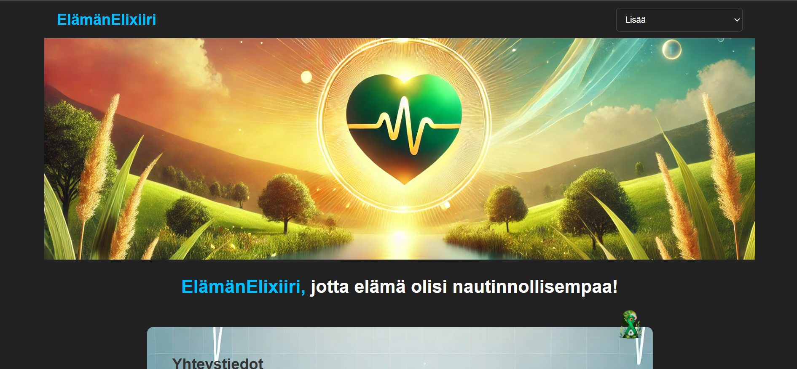

# Sovelluksen nimi

Tämä on ElämänElixiiri.

## Kuvakaappaukset

*Etusivun näkymä*

*Päiväkirjakortit käyttöliittymässä*

*Kirjautumisen näkymä*

*Rekisteröitymisen näkymä*

## Linkit

- **Front-end sovellus**: http://localhost:5173/
  
- **Back-end API**:  http://127.0.0.1:3000/

## Tietokannan kuvaus

Sovelluksessa käytetään [tietokannan tyyppi, esim. MySQL, MongoDB]. Tietokanta on rakennettu seuraavalla rakenteella:

- **Taulut**:
  - `entries` - Tallentaa käyttäjän päiväkirjamerkinnät (kentät: `user_id`, `entry_id`, `created_at`, `entry_date`, `mood`, `weight`, `sleep_hours`, `notes`)
  - `users` - Tallentaa käyttäjätiedot (kentät: `user_id`, `created_at`, `user_level`, `username`, `email`, `password`)

## Toiminnallisuudet

Sovellus sisältää seuraavat toiminnot:

- **Käyttäjärekisteröityminen ja kirjautuminen**: Käyttäjä voi rekisteröityä ja kirjautua sisään.
- **Päiväkirjamerkintöjen luominen**: Käyttäjät voivat lisätä päiväkirjamerkintöjä, joissa he voivat tallentaa tietoja kuten päivä, mieliala, paino, unetunnit ja muistiinpanot.
- **Päiväkirjan näyttäminen**: Käyttäjät voivat katsella omia päiväkirjamerkintöjään.

## Referenssit

- Tuntiesimerkit
- ChatGPT
- Github Copilot
- W3Schools
- Reddit

